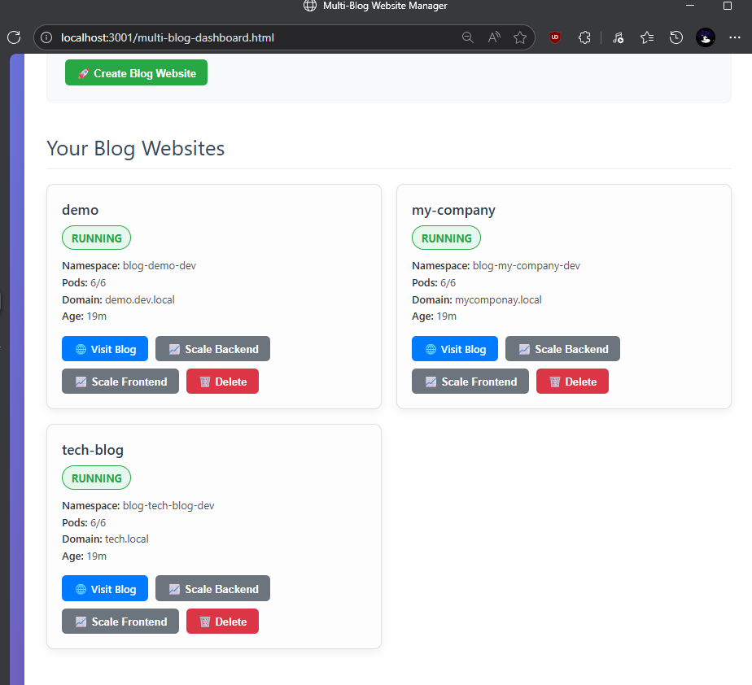
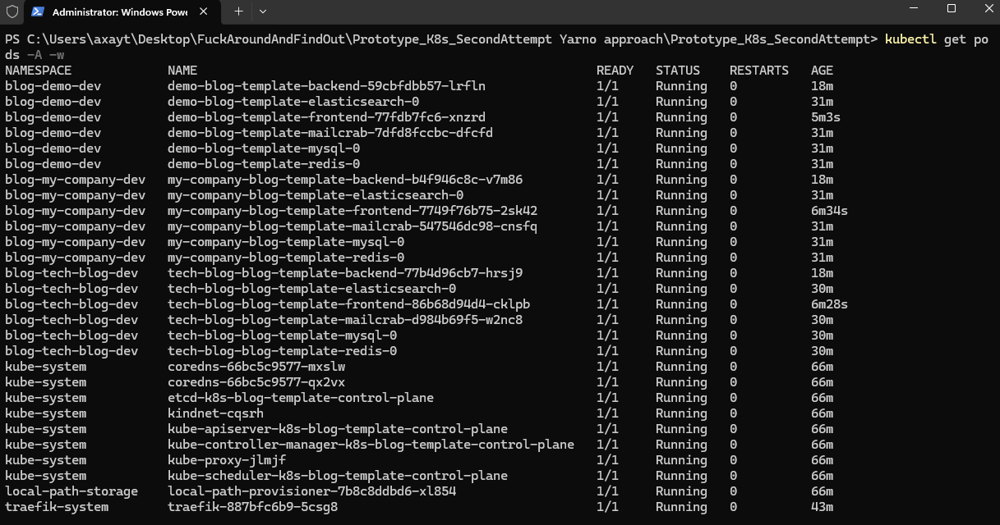
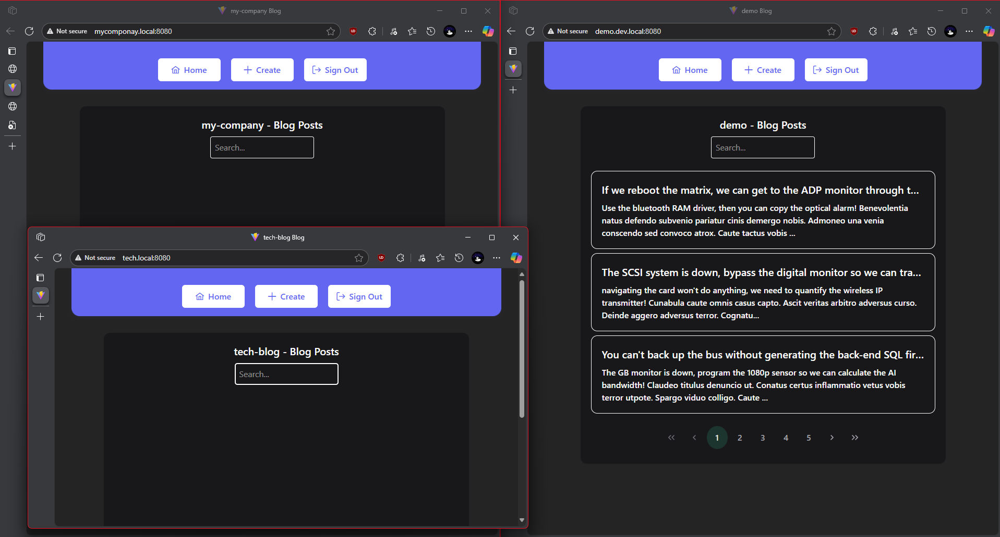
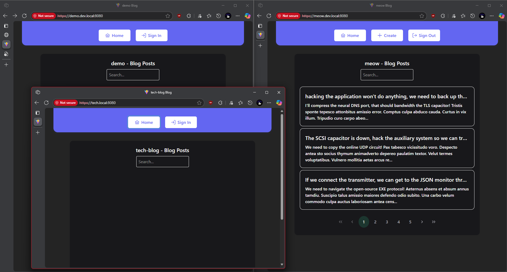

# Multi-Tenant Kubernetes Blog Template System

## Overview

A comprehensive multi-tenant Kubernetes deployment system for isolated blog applications. Each client deployment gets its own complete infrastructure stack with automated configuration and port management. Features a web dashboard for easy management of multiple blog websites.

## Team Setup

For team members, see:
- **[README-TEAM.md](README-TEAM.md)** - Quick team instructions
- **[TEAM-SETUP.md](TEAM-SETUP.md)** - Detailed team setup guide

**Quick Start for Team Members:**
1. Run `install-prerequisites.bat` as Administrator (one-time setup)
2. Run `start-system.bat` to start the system
3. Open http://localhost:3001/multi-blog-dashboard.html

## Quick Start (Fresh Machine)

### Visual Demo
See the system in action with these screenshots:
- **Dashboard**: [screenshots/dashboard.png](screenshots/dashboard.png) - Web management interface
- **Terminal**: [screenshots/terminal.png](screenshots/terminal.png) - Kubernetes pod status
- **Web Interface**: [screenshots/web-side.png](screenshots/web-side.png) - Blog website view
- **Secure Interface**: [screenshots/web-side-secure.png](screenshots/web-side-secure.png) - HTTPS-enabled blogs

### Prerequisites Installation

**Option 1: Using Chocolatey (Recommended)**
```powershell
# Install Chocolatey if not already installed
Set-ExecutionPolicy Bypass -Scope Process -Force; [System.Net.ServicePointManager]::SecurityProtocol = [System.Net.ServicePointManager]::SecurityProtocol -bor 3072; iex ((New-Object System.Net.WebClient).DownloadString('https://community.chocolatey.org/install.ps1'))

# Install all prerequisites
choco install docker-desktop kubernetes-cli kind kubernetes-helm nodejs npm git -y

# Restart PowerShell/Command Prompt after installation
```

**Option 2: Manual Installation**
1. **Docker Desktop**: Download from [docker.com](https://www.docker.com/products/docker-desktop/)
2. **Node.js**: Download from [nodejs.org](https://nodejs.org/) (LTS version)
3. **Kind**: `choco install kind` or download from [kind.sigs.k8s.io](https://kind.sigs.k8s.io/)
4. **Helm**: `choco install kubernetes-helm` or download from [helm.sh](https://helm.sh/)
5. **kubectl**: `choco install kubernetes-cli` or download from [kubernetes.io](https://kubernetes.io/)

### One-Command Setup

```powershell
# Clone the repository
git clone <your-repo-url>
cd Prototype_K8s_SecondAttempt

# Run the automated setup script
.\setup-fresh-machine.ps1
```

### Manual Setup (Step by Step)

```powershell
# 1. Start Docker Desktop and wait for it to be ready

# 2. Create Kubernetes cluster
kind create cluster --name k8s-blog-template

# 3. Install Traefik load balancer
helm repo add traefik https://traefik.github.io/charts
helm install traefik traefik/traefik --namespace traefik-system --create-namespace --wait

# 4. Build and load Docker images
docker build -t blog-backend:latest .\basic-blog\basic-backend\
docker build -t blog-frontend:latest .\basic-blog\basic-frontend\
kind load docker-image blog-backend:latest --name k8s-blog-template
kind load docker-image blog-frontend:latest --name k8s-blog-template

# 5. Install dashboard dependencies
npm install express

# 6. Start the multi-blog dashboard
node command-runner.js

# 7. Access dashboard at http://localhost:3001/multi-blog-dashboard.html
```

## Multi-Blog Dashboard

Access the web dashboard at `http://localhost:3001/multi-blog-dashboard.html` to:
- Create unlimited blog websites
- View all running blogs with status
- Scale backend/frontend pods
- Delete blogs
- Monitor resource usage

### Dashboard Screenshots


*Web dashboard showing all running blog websites with management controls*


*Terminal showing Kubernetes pods and system status*


*Blog website interface with sample content*


*HTTPS-enabled blog interface with SSL certificates*

## Architecture

**Core Components:**
- **NestJS Backend** (API server with TypeORM)
- **Vue.js Frontend** (SPA with PrimeVue UI)
- **MySQL 8.0** (Database with migrations)
- **Redis 7.4** (Cache and sessions)
- **Elasticsearch 8.15** (Search functionality)
- **MailCrab** (Email testing)
- **Traefik** (Load balancer with ingress)

**Features:**
- **Multi-tenant**: Isolated namespaces per client
- **Auto-scaling**: Dynamic pod scaling
- **Security**: Auto-generated secrets and RBAC
- **Monitoring**: Health checks and resource management
- **Web Dashboard**: Easy management interface
- **One-click Deploy**: Generate and deploy blogs instantly

## Backup & Restore

### Create System Backup
```powershell
# Create complete system backup
.\backup-system-simple.ps1 -BackupName "my-blog-system-backup"

# This creates:
# - Docker images export
# - Kubernetes manifests
# - Database dumps
# - Configuration files
```

### Restore from Backup
```powershell
# Restore complete system
.\restore-system.ps1 -BackupName "my-blog-system-backup"

# Or restore to fresh machine
.\restore-system.ps1 -BackupName "my-blog-system-backup" -FreshMachine
```

### Moving to Another Machine

#### Step 1: Create Backup on Source Machine
```powershell
# On your current machine - Easy migration helper
.\migrate-to-new-machine.ps1

# Or create backup manually
.\backup-system-simple.ps1 -BackupName "my-blog-system"

# This creates a backup in .\backups\my-blog-system-[timestamp]\
```

#### Step 2: Transfer Backup to New Machine
```powershell
# Copy the entire backup folder to your new machine
# The backup folder contains everything needed:
# - Docker images (blog-backend.tar, blog-frontend.tar)
# - Kubernetes manifests (all namespaces and resources)
# - Database dumps (SQL files for each blog)
# - Configuration files (templates, scripts, dashboard)
```

#### Step 3: Setup New Machine
```powershell
# On the new machine, install prerequisites first
choco install docker-desktop kubernetes-cli kind kubernetes-helm nodejs npm git -y

# Clone the repository
git clone <your-repo-url>
cd Prototype_K8s_SecondAttempt

# Copy your backup folder to .\backups\ directory
# Then restore the system
.\restore-system.ps1 -BackupName "my-blog-system" -FreshMachine
```

#### Step 4: Verify Everything Works
```powershell
# Start the dashboard
node command-runner.js

# Open dashboard at http://localhost:3001/multi-blog-dashboard.html
# All your blogs should be restored and running!
```

### Export/Import Docker Images (Alternative Method)
```powershell
# Export all images
docker save blog-backend:latest blog-frontend:latest -o blog-images.tar

# Import on another machine
docker load -i blog-images.tar
kind load docker-image blog-backend:latest --name k8s-blog-template
kind load docker-image blog-frontend:latest --name k8s-blog-template
```

## Project Structure

```
├── basic-blog/                  # Source applications
│   ├── basic-backend/          # NestJS API server
│   └── basic-frontend/         # Vue.js SPA
├── helm-blog-template/          # Helm chart templates
├── template-generator/          # Client management tools
├── deployments/                # Generated client configs
├── multi-blog-dashboard.html    # Web management interface
├── command-runner.js           # Dashboard backend server
├── setup-fresh-machine.ps1     # Automated setup script
├── backup-system.ps1           # Backup creation script
└── restore-system.ps1          # Restore from backup script
```

## Management Commands

### Dashboard Management
```powershell
# Start the multi-blog dashboard
node command-runner.js

# Access dashboard
# http://localhost:3001/multi-blog-dashboard.html
```

### CLI Management
```powershell
# Generate new client
.\template-generator\Generate-ClientDeployment.ps1 -ClientName "client-name" -Environment "production"

# List all clients
.\template-generator\Show-Clients.ps1

# Remove client
.\template-generator\Remove-Client.ps1 -ClientName "old-client"
```

### Kubernetes Management
```powershell
# View all blogs
kubectl get namespaces | findstr blog-

# Scale a blog's backend
kubectl scale deployment client-name-blog-template-backend --replicas=3 -n blog-client-name-dev

# View blog logs
kubectl logs -f deployment/client-name-blog-template-backend -n blog-client-name-dev
```

## Accessing Your Blogs

### Via Dashboard
1. Open `http://localhost:3001/multi-blog-dashboard.html`
2. Click "Visit Blog" for any running blog
3. Use the domain shown (e.g., `demo.dev.local`)

### Via Direct URLs
- **Demo Blog**: `http://demo.dev.local:8080/` or `https://demo.dev.local:8080/`
- **Tech Blog**: `http://tech.local:8080/` or `https://tech.local:8080/`
- **Meow Blog**: `http://meow.dev.local:8080/` or `https://meow.dev.local:8080/`
- **Custom Blogs**: `http://your-domain.local:8080/` or `https://your-domain.local:8080/`

### Hosts File Setup
Add these entries to `C:\Windows\System32\drivers\etc\hosts`:
```
127.0.0.1 demo.dev.local
127.0.0.1 tech.local
127.0.0.1 meow.dev.local
127.0.0.1 mycomponay.local
127.0.0.1 mycompany.local
```

### SSL/HTTPS Support
The system includes SSL certificate support for secure local development:
- **Automatic HTTP→HTTPS redirect**
- **Trusted certificates** (no browser warnings)
- **Multi-domain support** for all blog domains
- **Production-ready** SSL configuration

Run `.\setup-ssl-complete.ps1` to enable HTTPS for all blogs.

## Use Cases

- **SaaS Platform**: Isolated infrastructure per customer
- **Agency/Consulting**: Multiple client projects in one cluster
- **Multi-Environment**: Consistent dev/staging/production setup
- **Educational**: Learn Kubernetes with real applications
- **Prototyping**: Rapid blog deployment for testing

## System Status & Monitoring

### Real-Time Dashboard
The multi-blog dashboard provides real-time monitoring of all deployed blogs:

- **Pod Status**: View running/stopped pods for each blog
- **Resource Usage**: Monitor CPU and memory consumption
- **Health Checks**: Automatic health monitoring for all services
- **Scaling Controls**: Scale backend/frontend pods on demand
- **Log Access**: View logs for troubleshooting

### Current System Metrics
- **18 Total Pods** running across all blog namespaces
- **3 Complete Blog Stacks** (backend, frontend, mysql, redis, elasticsearch, mailcrab each)
- **300+ Total Blog Posts** (100+ per blog with sample data)
- **All Ingresses** configured with Traefik load balancer
- **SSL Support** for secure local development

## Documentation

For complete setup instructions, troubleshooting, and advanced configuration, see **[GUIDE.md](GUIDE.md)**.

## Troubleshooting

### Common Issues
1. **Port 8080 in use**: Kill existing processes with `netstat -ano | findstr :8080`
2. **Docker not running**: Start Docker Desktop and wait for it to be ready
3. **Kind cluster issues**: Delete and recreate with `kind delete cluster --name k8s-blog-template`
4. **Dashboard not loading**: Ensure `node command-runner.js` is running
5. **Dashboard stopped working**: Restart with `node command-runner.js` in project directory
6. **Blogs not accessible**: Check hosts file entries and run `.\update-hosts.ps1` as Administrator
7. **SSL certificate issues**: Run `.\setup-ssl-complete.ps1` to regenerate certificates

### Reset Everything
```powershell
# Nuclear option - reset everything
kind delete cluster --name k8s-blog-template
docker system prune -a
.\setup-fresh-machine.ps1
```

## Quick Migration Reference

### Current Machine → New Machine
```powershell
# 1. Create backup
.\migrate-to-new-machine.ps1

# 2. Copy backup folder to new machine
# 3. On new machine:
choco install docker-desktop kubernetes-cli kind kubernetes-helm nodejs npm git -y
git clone <your-repo>
cd Prototype_K8s_SecondAttempt
# Copy backup to .\backups\ directory
.\restore-system.ps1 -BackupName "migration-backup" -FreshMachine
node command-runner.js
```

### Fresh Machine Setup
```powershell
# Install prerequisites
choco install docker-desktop kubernetes-cli kind kubernetes-helm nodejs npm git -y

# Automated setup
.\setup-fresh-machine.ps1

# Or manual setup (see README for details)
```

## Current Deployment Status

### System Running Successfully
- **Dashboard Server**: Running on http://localhost:3001/
- **3 Blog Websites**: Demo, Tech Blog, and Meow blogs deployed
- **18 Kubernetes Pods**: All services running and healthy
- **Database Seeded**: 100+ sample blog posts per website
- **SSL Support**: HTTPS certificates configured for secure access

### Quick Access
1. **Start Dashboard**: `node command-runner.js`
2. **Open Dashboard**: http://localhost:3001/multi-blog-dashboard.html
3. **Visit Blogs**: 
   - Demo: http://demo.dev.local:8080/
   - Tech: http://tech.local:8080/

## License

MIT License - see LICENSE file for details.
